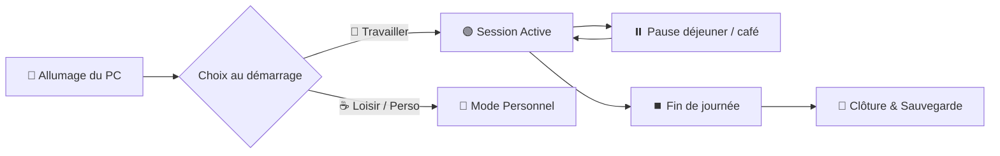

# ⏱️ KRT Bookings Tracker — Guide Utilisateur

Bienvenue sur le guide d'utilisation de **KRT Bookings Tracker**, l'application de suivi de temps et de pointage automatique conçue pour les équipes de **KRT Studios**.

---

## 🎯 À quoi sert cette application ?

**KRT Bookings Tracker** simplifie votre quotidien en comptabilisant précisément votre temps de travail sans paperasse ni saisie manuelle fastidieuse :

- 🕒 **Comptage automatique** de vos heures travaillées dès l'allumage de votre ordinateur.
- ☕ **Respect de votre vie privée** grâce à un mode personnel débrayable en 1 clic.
- 📊 **Tableau de bord clair** affichant votre temps en direct, votre heure de début et votre fin de journée estimée.
- 🔄 **Mises à jour transparentes** sans manipulation technique.

---

## 📥 Guide d'Installation (Téléchargement & Mise en route)

### Étape 1 : Télécharger l'application
1. Rendez-vous sur la page officielle des versions : [👉 Télécharger la dernière version (GitHub Releases)](https://github.com/kyomitv/krt-bookings-tracker/releases/latest).
2. Dans la section **Assets** en bas de la publication, cliquez sur **`KRT-Bookings-Tracker.exe`** pour télécharger le programme d'installation autonome.

> [!TIP]
> **Emplacement conseillé :** Une fois le fichier téléchargé, placez-le dans un dossier permanent de votre choix (par exemple dans votre dossier `Documents\KRT Tracker` ou `Programmes`). Évitez de le laisser dans votre dossier temporaire *Téléchargements*.

---

### Étape 2 : Premier lancement & Sécurité Windows

1. Double-cliquez sur **`KRT-Bookings-Tracker.exe`**.
2. **Alerte Windows SmartScreen ?** *(Fréquent lors du premier téléchargement d'une application interne)* :
   - Si une fenêtre bleue s'affiche disant *"Windows a protégé votre ordinateur"* :
     1. Cliquez sur le lien texte **« Informations complémentaires »**.
     2. Cliquez ensuite sur le bouton **« Exécuter quand même »**.

---

### Étape 3 : Connexion à votre compte KRT

Au premier lancement, la fenêtre de connexion sécurisée s'affiche :

1. Renseignez votre **adresse e-mail professionnelle** et votre **mot de passe** KRT.
2. Cliquez sur **« Se connecter »**.
3. Une fois connecté, vos identifiants sont sauvegardés de façon **chiffrée et sécurisée** sur votre ordinateur. Vous n'aurez plus besoin de les ressaisir !

---

### Étape 4 : Lancement automatique configuré !

🎉 **Félicitations, l'installation est terminée !**
- L'application s'inscrit automatiquement dans le démarrage de votre ordinateur : vous n'avez pas besoin de créer de raccourci spécial.
- L'application vient se placer discrètement dans la **zone de notification** (en bas à droite de votre écran, à côté de l'horloge Windows).

---

## ☀️ Votre Routine Quotidienne

### 1. Le Matin : Allumage de l'ordinateur
Dès l'ouverture de votre session Windows, une fenêtre interactive s'affiche :

- **💼 Travailler (Journée pro)** : Démarre immédiatement votre journée de travail et enclenche le chronomètre.
- **☕ Mode Loisir / Perso** : Si vous allumez votre ordinateur pour un usage personnel (week-end, soirée, congés). Aucun suivi n'est effectué et aucun temps de travail n'est décompté.

---

### 2. En cours de journée : La Barre des Tâches (Systray)
L'icône KRT se loge discrètement en bas à droite de votre écran. Sa couleur vous indique votre statut en un coup d'œil :

| Icône | Statut | Signification |
| :--- | :--- | :--- |
| 🟢 **Pastille Verte** | **En cours** | Session de travail active, vos heures sont comptabilisées. |
| 🟡 **Pastille Jaune** | **En pause** | Pause temporaire (repas, pause café). Le chronomètre est suspendu. |
| 🔵 **Pastille Bleue** | **Mode Perso** | Mode personnel / loisir. Aucun suivi RH. |

> [!TIP]
> **Icône masquée ?** Si vous ne voyez pas l'icône, cliquez sur la petite flèche **`^`** dans la barre des tâches de Windows pour faire apparaître les icônes cachées.

---

### 3. Le Clic Droit : Menu d'Actions Rapides
Faites un **clic droit** sur l'icône KRT dans la barre des tâches pour :

- ⏱️ **Suivi de la journée (Dashboard)** : Ouvrir le tableau de bord détaillé.
- ⏸️ **Mettre en pause** / ▶️ **Reprendre le travail** : Gérer vos temps de pause en 1 seconde.
- ☕ **Passer en mode loisir / perso** : Basculer temporairement hors du mode pro.
- 🔄 **Vérifier les mises à jour...** : Vérifier si une nouvelle version est disponible.
- ⏹️ **Terminer la journée & Quitter** : Clôturer et enregistrer votre journée.

---

### 4. Le Tableau de Bord « Suivi de la journée »

Double-cliquez sur l'icône ou sélectionnez **Suivi de la journée** pour ouvrir le dashboard :

Dans cette fenêtre, vous retrouvez :
1. **Votre Profil** : Nom, prénom et rôle.
2. **Le Chronomètre en direct** : Durée de votre session actuelle.
3. **Les Repères Horaires** :
   - Heure de début de la session.
   - **Fin de journée estimée** (calculée automatiquement sur une base de 7h de travail + 1h30 de pause repas).
4. **Le Total de la Journée** : Cumul de toutes vos sessions travaillées aujourd'hui.
5. **Indicateur de Synchronisation** : Confirme que vos données sont bien transmises en temps réel.
6. **Boutons d'action directs** : Pour mettre en pause ou terminer votre journée sans passer par le menu.

> [!NOTE]
> Vous pouvez fermer la fenêtre du tableau de bord (croix en haut à droite) à tout moment : l'application continuera de fonctionner en arrière-plan sans interrompre votre session.

---

### 5. Le Soir : Fin de Journée
Lorsque votre journée est terminée :
1. Cliquez sur **⏹️ Terminer la journée de travail** (depuis le tableau de bord ou par clic droit sur l'icône).
2. Une boîte de dialogue de confirmation vous résume la durée totale effectuée.
3. Cliquez sur **Confirmer et Quitter** : votre journée est définitivement enregistrée sur les serveurs KRT et l'application se ferme proprement.

---

## 🔄 Mises à Jour Automatiques

Vous n'avez rien à réinstaller manuellement :
- L'application recherche automatiquement les mises à jour au démarrage et en arrière-plan.
- Lorsqu'une nouvelle version est disponible, une notification vous propose de l'installer.
- Cliquez simplement sur **Mettre à jour** : la nouvelle version est téléchargée, installée et redémarrée automatiquement en quelques secondes.

---

## 🔒 Vie Privée & Sécurité

La confiance et le respect de la vie privée sont au cœur de l'application :

- ❌ **Aucune capture d'écran** ni enregistrement de frappes (keylogger).
- ❌ **Aucune surveillance** des sites web consultés, des applications ouvertes ou des fichiers.
- ❌ **Aucune géolocalisation**.
- ✅ **Uniquement la mesure du temps de travail effectif** et l'indication de présence pour l'organisation de l'équipe.
- 🔐 **Sécurité renforcée** : Vos accès sont chiffrés localement sur votre poste avec les standards de sécurité les plus stricts.

---

## ❓ Foire Aux Questions (FAQ)

<b>J'ai oublié de mettre en pause pendant ma pause déjeuner, que faire ?</b>

 
Mettez en pause dès que vous vous en rendez compte, ou signalez-le simplement à votre responsable d'équipe / RH afin qu'un ajustement soit effectué sur votre fiche de présence.

<b>Que se passe-t-il si je perds ma connexion Internet ?</b>

 
Aucune inquiétude : l'application continue de comptabiliser votre temps localement. Dès que votre connexion Internet est rétablie, toutes les données sont automatiquement synchronisées sans perte.

<b>L'application ne s'ouvre plus ou j'ai un message d'erreur de connexion ?</b>

 
Vérifiez que votre connexion Internet fonctionne bien. Si le problème persiste, vérifiez que votre mot de passe n'a pas été modifié ou contactez le support technique interne.

<b>Comment utiliser mon PC le week-end sans que mon temps soit compté ?</b>

 
Au démarrage du PC, cliquez simplement sur <b>☕ Mode Loisir / Perso</b> sur la fenêtre d'accueil. L'application reste inactive et aucune heure de travail n'est enregistrée.

---

## 📞 Support & Assistance

En cas de question ou de besoin d'assistance technique, contactez l'équipe support KRT :
- 🌐 **Site web** : [krtstudios.tv](https://krtstudios.tv)
- 🏢 **KRT Studios** — Orsay, Paris
